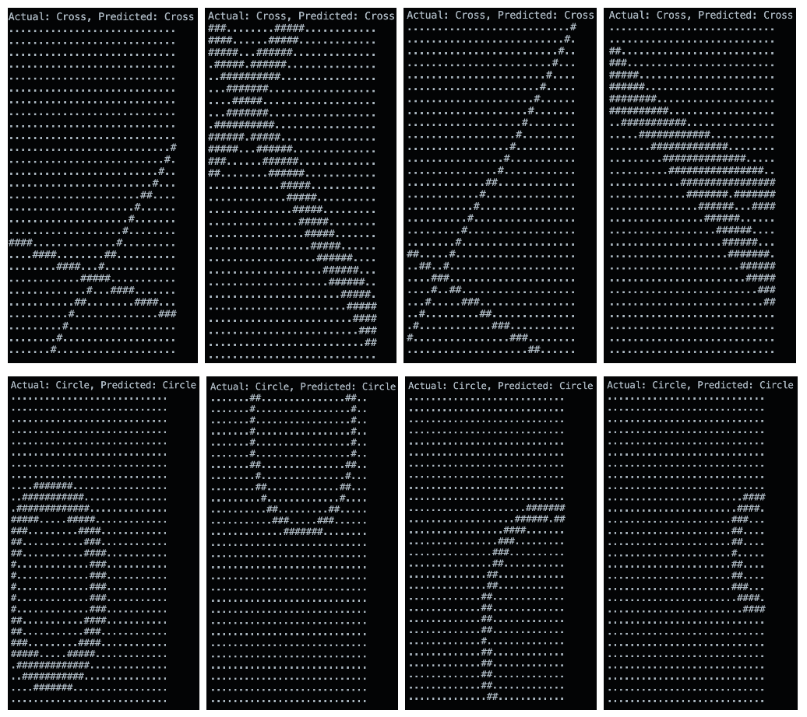
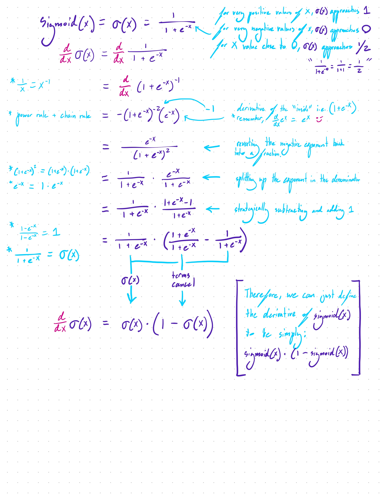
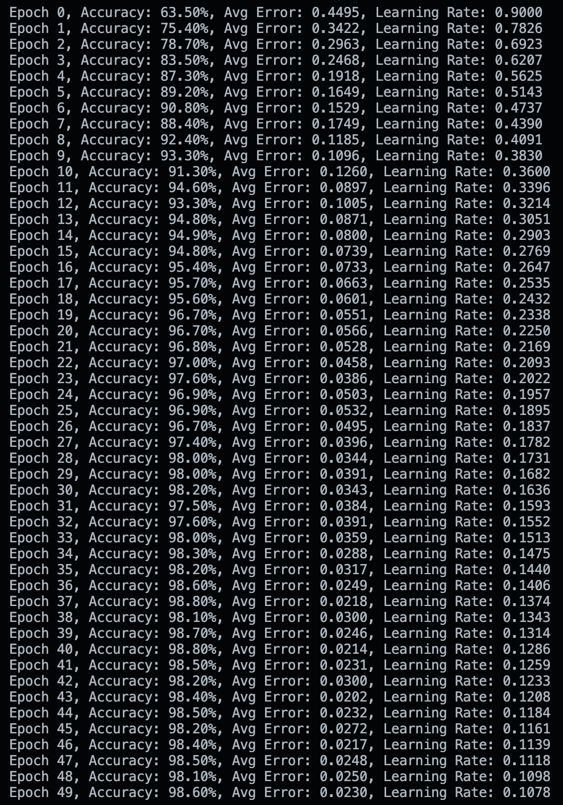

# Circles and Crosses !! xo

## Introduction

For instructions on how to run, scroll down to the bottom and find `Quick Run`. Now for, an in-depth explanation:

The universe is filled with patterns, and patterns can be described using mathematical functions. Neural networks are structures created from linking together a large amount of quite simple machines (neurons) and tuning their individual behavior based on the entire network's performance. Using pretty much just linear matrix operations, nonlinear activation functions, and gradient based learning, we can create a mathematical object that can learn patterns (by generating a function that could have potentially created that pattern, and therefore having the ability to generalize beyond the dataset it was given). I have demonstrated in a previous project (see `Scratchnn` and `ScratchnnV2` repositories) that even an extremely simple neural network can easily fit to a nonlinear boolean function (e.g. NOR or NAND), which makes them Turing Complete. In addition, there are rigorous proofs that discuss the "universal approximation theorems" - regarding the functions in which networks of varying depth or width can fit to - which conclude that a network of a hypothetical infinite depth could fit to absolutely any function. Deep neural nets are useful!  

--

`CircleCrossnnLRdecay.c` contains the code for creating a feed-forward fully-connected neural network in C. Upon running, it will generate a synthetic dataset of 28 x 28 = 784 "pixel" images out of `.` and `#` characters. The network’s depth, width, learning rate (scalar multiple of the negative gradient vector), learning rate decay, and more are easily tunable using `TuneCLI.c`.

--

## Here are some examples of crosses and circles that can be generated: 



Using rough calculations, I have estimated that about 2 million unique crosses and 20 thousand unique circles can be generated in this way (circles look the same if they are rotated, crosses don't). This is a testament to the network's ability to fit to a dataset of high nonlinearity and dimensionality, finding its own hidden representations of how to identify circles and crosses.

## Features

- **Dynamic Memory Allocation**: Utilizes `safe_malloc` for memory management.
- **Sigmoid Activation Function**: Implements both sigmoid and its derivative.
- **Matrix Multiplication, Forward Propagation, and Backward Propagation**: All done by hand
- **Adaptive Learning Rate**: Implements a decay-based learning rate adjustment.
- **Random Image Generation**: Synthetic Ddtaset
- **Console-based Visualization**: Displays generated images in the command line console.

## Key Functions

- `init_network`: Initializes the neural network structure.
- `forward_propagation`: Performs forward pass through the network.
- `backward_propagation`: Implements backprop 
- `adjust_learning_rate`: Adapts the learning rate based on epoch and error.
- `generate_image`: Creates random cross or circle images for training/testing.
- `draw_line`: Utility function for image generation.
- `print_image`: Visualizes the generated images in the console.

## Network Architecture (easily tunable using `TuneCLI.c` or by manually changing the code)

1. Input Layer: 784 neurons (28x28 image)
2. Hidden Layer 1: 64 neurons
3. Hidden Layer 2: 20 neurons
4. Hidden Layer 3: 20 neurons
5. Output Layer: 2 neurons (cross or circle)

## Training Process

1. Initialize the network with random weights and biases.
2. For each epoch:
   - Generate random training examples.
   - Perform forward propagation.
   - Calculate error and perform backward propagation.
   - Update weights and biases.
   - Adjust learning rate.
3. After training, test the network on new examples.

## Implementation of Mathematics (i.e. Matrix Operations, Nonlinear Functions, Forward and Backwards Prop, etc.)

### Data Structures

1. Weights:
   - Stored as flattened 1D arrays representing 2D matrices
   - `nn->weights[i]` is an array of doubles, where `i` is the layer index
   - Size: `layer_sizes[i] * layer_sizes[i+1]`
   - Access: `nn->weights[i][k * layer_sizes[i+1] + j]` for weight from neuron k in layer i to neuron j in layer i+1

2. Biases:
   - Stored as 1D arrays for each layer
   - `nn->biases[i]` is an array of doubles for layer i+1
   - Size: `layer_sizes[i+1]`

3. Activations:
   - Stored as 1D arrays for each layer
   - `nn->activations[i]` is an array of doubles for layer i
   - Size: `layer_sizes[i]`

i, j, and k in  `nn->weights[i-1][k * nn->layer_sizes[i] + j]` :

* i-1: Selects the weight matrix between layers i-1 and i
* k: Represents the neuron in the previous layer (row of the weight matrix)
* j: Represents the neuron in the current layer (column of the weight matrix)

### Forward Propagation

The core operation is:
```c
for (int i = 1; i < nn->num_layers; i++) {
    for (int j = 0; j < nn->layer_sizes[i]; j++) {
        double sum = nn->biases[i-1][j];
        for (int k = 0; k < nn->layer_sizes[i-1]; k++) {
            sum += nn->activations[i-1][k] * nn->weights[i-1][k * nn->layer_sizes[i] + j];
        }
        nn->z_values[i][j] = sum;
        nn->activations[i][j] = sigmoid(sum);
    }
}
```

This implements the matrix operation:
A[i] = sigmoid(W[i-1] * A[i-1] + B[i-1])
Where:

A[i] is the activation vector for layer i
W[i-1] is the weight matrix between layer i-1 and i
B[i-1] is the bias vector for layer i

The nested loops perform dot product calculations between rows of the weight matrix and the activation vector from the previous layer.

### Backward Propagation

The backward pass calculates gradients and updates weights:

Output Layer Error:

```c
for (int i = 0; i < nn->layer_sizes[output_layer]; i++) {
    double error = nn->activations[output_layer][i] - target[i];
    delta[i] = error * sigmoid_derivative(nn->activations[output_layer][i]);
}
```
This computes the error vector for the output layer.

Hidden Layer Error:

```c
for (int i = 0; i < nn->layer_sizes[l]; i++) {
    double error = 0.0;
    for (int j = 0; j < nn->layer_sizes[l+1]; j++) {
        error += delta[j] * nn->weights[l][i * nn->layer_sizes[l+1] + j];
    }
    prev_delta[i] = error * sigmoid_derivative(nn->activations[l][i]);
}
```

This propagates the error backwards, computing the transpose of the weight matrix multiplied by the delta vector of the next layer.

Weight Updates:

```c
for (int i = 0; i < nn->layer_sizes[l]; i++) {
    for (int j = 0; j < nn->layer_sizes[l+1]; j++) {
        nn->weights[l][i * nn->layer_sizes[l+1] + j] -= learning_rate * nn->activations[l][i] * delta[j];
    }
}
```

This updates each weight individually based on the gradient calculation.

### Weight Update Rule

During backpropagation, weights are updated using the following rule:

```c
new_weight = old_weight - learning_rate * input_activation * delta
```

Where `delta` is the error term calculated for each neuron.

### Sigmoid function and derivative

```c
// Activation function: Sigmoid
    return 1 / (1 + exp(-x));
}
```
The classic S-shaped activation function. As values of x approach infinity, outputs of sigmoid(x) approach 1. As x approaches negative infinity, sigmoid(x) approaches 0. At `x = 0`, sigmoid(x) returns 1/2. `1/(1+e^-0)` = `1/(1+1)` = `1/2`

```c
// Derivative of sigmoid function
// Used in backpropagation to calculate gradients
// This represents the slope of the sigmoid function at a given point
double sigmoid_derivative(double x) {
    return x * (1 - x); // Simplified derivative based on the sigmoid output
    // This simplification works because we're passing in the sigmoid output, not the input
}
```

So, why can we say that the derivative of sigmoid(x) is equal to (1 - sigmoid(x))?

I've provided the differentiation process for the sigmoid derivative, I apologize if the handwriting is difficult to read:



### Learning Rate Update

So, I noticed that at the start of training a high learning rate works really well for improving accuracy, however, near the end of training, the high learning rate could actually cause some discrepancies. Becuase of this, the learning rate is dynamically adjusted during training using the `adjust_learning_rate` function:

```c
double adjust_learning_rate(double current_rate, int epoch, double error) {
    double new_rate = INITIAL_LEARNING_RATE / (1 + DECAY_RATE * epoch);
    if (new_rate < MIN_LEARNING_RATE) {
        new_rate = MIN_LEARNING_RATE;
    }
    return new_rate;
}
```

This formula reduces the learning rate over time. As epoch increases, the denominator increases, causing new_rate to decrease.
INITIAL_LEARNING_RATE (default: 0.9) sets the starting point.
DECAY_RATE (default: 0.15) controls how quickly the rate decreases.

## Future Improvements 

- Add a third output class for no circle or cross 
- Implement batch training rather than just stochastic gradient descent for improved efficiency.
- Extend the network to classify more shapes or real-world images using a dataset.
- Add convolutional layers.
  

# Quick Run

Copy the code from my `CircleCrossnnLRdecay.c` file and paste it into a .c file of your own, say `circlecross.c`.

In your command line, cd into the directory where the .c file is saved, and compile the C file into machine code:

```bash
gcc -o circlecross circlecross.c -lm
```

Then run the executable:

```bash
./circlecross.c
```

The program will train the network and then test it on new examples, displaying the results in the command line console.

### Here’s what it should look like during training: 




